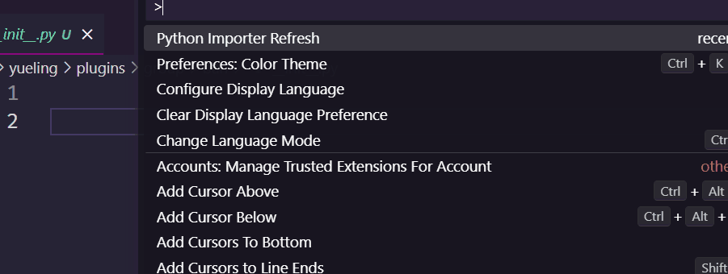

## 介绍

一个本项目内的函数导入器, 可以使用相对路径/绝对路径

## 特点

可以基于当前路径 自动导入函数(本项目内的)

from ...common.base import foo

或者

from common.base import foo



## 原理

本插件会自动检测 `__init__.py` 的 `__all__`导出的函数, 并追加提示词

## 运行时机

1. 运行 `Python Importer Refresh`
2. 当 `__init__.py` 文件保存时

## 配置

需要在工作路径配置 `pyproject.toml`

```toml
[tool.python-importer.import]
relative = false      # 是否为相对路径, 默认为 false
exclude= [            # 要排除的文件夹名, 默认为 [], 默认忽略. _ 开头的文件夹
    "dist",
    "test",
]

```

## 计划

- 使用函数时自动导入
- 自动记录本项目内的所有导入
